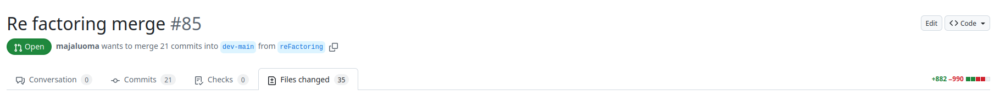

# Ohjelmointiteknologiat Projekti

Tavoitteena on tutustua funktionaalisen ohjelmoinnin filosofiaan sekä tarkastella sitä suhteessa Reactin hyviin käytänteisiin. Lisäksi tavoitteena on kartuttaa ymmärrystä Reactin peruselementeistä kuten tilanhallinnasta ja koukuista.

Aloitin etsimällä lähteitä. Halusin ensin tutustua ylipäätään funktionaaliseen ohjelmointiin, joten aloitin Kyle Simpsonin (2017) kirjasta Functional-Light JavaScript: Balanced, Pragmatic FP in JavaScript.

## Funktionaalisen ohjelmoinnin perusteita

Funktionaalinen ohjelmointi pyrkii koodin luettavuuteen, siihen että niin kehittäjä kuin muutkin voivat ymmärtää ja sitne myös luottaa koodiin. Ohjelmointifilosofian omaksumisen luvataan myös tutotavan vähemmän bugeja. Tässä oleellisena osana on asioiden nimeäminen, kun näet jonkin funktion, esimerkiksi `map()`, tiedät mitä se tekee, mutta kun näet sanan `for`, joudut usein lukemaan mitä se oikeastaan tekee. Koodissa tämä näkyy myös deklaratiivisuuden lisääntymisenä, kun ohjelman osat kuvaavat lopputulosta, eikä prosessia.(Simpson 2017, ch1).

Funktionaalisessa ohjelmoinnissa halutaan käyttää **funktioita** samaan tapaan, miten olemme ne yläasteellakin oppineet: `y = f(x)`. On funktio, sen parametrit ja aina palautusarvo. Jos palautusarvo on undefined, se palautetaan eksplisiittisesti. Tästä johtuen alla olevan kaltaisia **proseduureja ei käytetä** funktionaalisessa ohjelmoinnissa (Simpson 2017).

```ts
let numerot = [1, 4, 5, 3];
let summa = 0;
function summaa(arvo) {
    summa = arvo + summa;
}
numerot.forEach((e) => summaa(e));
```

Peruskäsitteitä funktiossa (Simpson 2017):

```ts
function foo(x, y, z) {
    //parametrit
}
foo.length; // arity --> 2
const a,
    b = 3; // argumentit
foo(a, b); // 2
```

Simpson painottaa, että ohjelmoinnissa olisi aina pyrittävä deklaratiivisuuteen ja siihen että asiat selittävät itse itsensä. Esimerkiksi on parempi tehdä

```ts
function foo( [x,y,...args] = [] ) {
    console.log(x, y)
}
function foo( args ) {
    const x, y = args[0], args[1]
    console.log(x, y)
}
```

Näin funktion määrittelyssä tulee selville, mitä funktio tekee (Simpson 2017). Ja nyt luulen että tuli ensimmäinen yhtymäkohta react -ohjelmointiin. Voisiko tämä selittää miksi Reactissa props (=args?) -parametri aina välitetään olentona? Katsotaan tätä kirjan esimerkkiä:

```ts
function foo({ x, y } = {}) {
    console.log(x, y);
}

foo({
    y: 3,
}); // undefined 3
```

Javascriptista on parametrien nimeäminen muttei argumenttien nimeämistä. Jos funktio on jotain näistä, ylläolevan tuloksen saavuttaminen on vaikeaa ilman parametrien olentohajoittamista (**parameter object destructuring**) (Simpson 2017):

-   Funktiossa on useita parametrejä ja niillä ei ole oletusarvoa.
-   Funktiota saatetaan käyttää joskus vähemmällä määrällä argumentteja kuin mitä funktiolla on parametreja TAI ne voivat olla vaihtelevassa järjestyksessä

Seuraavaksi käsiteltiin funktioiden palautusarvoja. Suosituksena on aina sisältää yksi `return` -lauseke eikä käyttää sitä funktion ennenaikaiseen lopettamiseen. Funktioista voi myös palauttaa useita arvoja, joskin sitäkin tulisi välttää jos mahdollista. (Simpson 2017).

```ts
const [tila = setTila] = useState();
```

Tärkeintä on kuitenkin pitää _funktio aitona_ (**pure function**), niin että sillä ei ole **sivuvaikutuksia** eikä se muuta arvoja funktion ulkopuolelta. Myös esimerkiksi `this` -käyttö nojaa implisiittisiin parametreihin, joten sitäkin olisi hyvä välttää. (Simpson 2017).

Seuraavaksi laitetaan funktioita funktioiden sisään. Funktio joka ottaa arvoksi toisen funktion, on korkeamman tason funktio, kuten `forEach()`. Simpson on erityisen pärinöissä siitä funtkioiden ominaisuudesta, että funktiot korkeamman tason funktioissa viittaavaat pysyvästi korkeamman tason argumentteihin (**closure**), vaikka niitä kutsuttaisiin myöhemmin toisessa paikassa (**scope**). (Simpson 2017).

```ts
function whatAnimalSays(voice) {
    return function makeVoice(addition = "") {
        console.log(voice + addition);
    };
}

var giraffe = whatAnimalSays("Kahvilikööri");

giraffe(); // Kahvilikööri
giraffe("!"); // Kahvilikööri!
```

Samalla esittelen ylläolevassa koodissa sen, miten tietoja voidaan määritellä lisää myös myöhemmissa kutsuissa.

Tämä on Simpsonin mukaan tyypillistä funktionaalisessa ohjelmoinnissa. Huomaa myös, että funktiolle sisällä on määritelty nimi, vaikkei sitä käytetä missään. Tämä kannattaa lähes aina, sillä se auttaa virhelogien läpikäymisessä. Simpson itse siksi välttääkin => -notaatiota, sillä se ei mahdollista funktioiden nimeämistä. Alla olevassa esimerkissä funktiolla kuitenkin on nimi (name inferencing), koska se sijoitetaan muuttujaan. (Simpson 2017).

```ts
const addExclamation = (str) => str + "!";
console.log(addExclamation.name); // addExclamation
```

Seuraavaksi otan tauon Simpsonin kirjasta, joka sisältää myös paljon työkaluja niille, jotka eivät pidä itse
funktionaalisesta ohjelmoinnista, mutta haluavat käyttää funktioita hyvin.

## Tapausesimerkki laadukkaasta React -ohjelmoinnista.

Tutustun välissä Alan Alickovicin ja kumppaneiden (2024) kirjoittamaan Bulletproof React -repositorioon, joka sisältää kattavan kuvauksen reactista pienistä yksityiskohdista skaalautuvaan infrastruktuuriin. Repositoriolla on 28 tuhatta tykkäystä ja useampi yhteiskirjoittaja.

React projektissa on hyvä pitää huoli hyvistä kirjoitusstandardeista (Alickovic ym. 2024), sillä kuten Simpsonkin totesi, funktionaalisessa ohjelmoinnissakin pyritään hyvään kommunikaatioon (Simpson 2017, ch1). Tämän mahdollistaa projektikohtaiset asetustiedostot root -kansiossa (Alickovic 2024):

-   .eslintrc kopnfiguroi syntaksivirheiden korjaamisen ja siihen kannattaa lisätä myös nimeämiskäytänteet
-   .prettierrc säännönmukaistaa tyylittelyt
-   tsconfig.json poistaa javascriptin dynaamisuuden tuomat haasteet. Lisäksi se sisältää absoluuttiset `import` polut.
-   .husky/ sisältää konfiguroinnit eri git -komennoille

Erimerkki tiedostojen nimeämiskäytänteiden lisäämisestä .eslintrc -asetuksiin (Alickovic 2024).

```json
'check-file/filename-naming-convention': [
          'error',
          {
            '**/*.{ts,tsx}': 'KEBAB_CASE',
          },
          {
            ignoreMiddleExtensions: true,
          },
```

Esimerkki absoluuttisen import -polun määrittelystä (Alickovic 2024)

```json
"paths": {
      "@/*": ["./src/*"]
    }
```

Ohjelmistoprojektissa käytämme Viteä ja tähän teknologiaankin nojautuen Alickovic ja kumppanit ehdottavat seuraavanlaista tiedostorakennetta projektiin (kommentteja muokattu alkuperäisestä):

```sh
src
|
+-- app               # application layer:
|   |
|   +-- routes        # can also be pages
|   +-- app.tsx       # main application component
|   +-- provider.tsx  # application provider differ based on meta framework
|   +-- router.tsx    # application router configuration
+-- assets            # assets folder can contain all the static files such as images, fonts, etc.
|
+-- components        # components used across the entire application
|
+-- config            # global configurations, exported env variables etc.
|
+-- features          # feature based modules
|
+-- hooks             # shared hooks used across the entire application
|
+-- lib               # reusable libraries preconfigured for the application
|
+-- stores            # global state stores
|
+-- testing           # test utilities and mocks
|
+-- types             # shared types used across the application
|
+-- utils             # shared utility functions
```

(Mukaillen Alickovic 2024).

Suurin osa koodista suositellaan pitämään features -kansiossa ominaisuuksittain. Ominaisuus voi aina sisältää omat kansionsa api, assets, components, hooks, stores, types ja utils. Kansiot kannattaa aina luoda tarpeen niin vaatiessa. Ominaisuuksien välisiä importointeja pitäisi ehdottomasti välttää. Projektin rakennetta käsittelevässä kappaleessa annetaan suoria vinkkejä esimerkiksi eslintin konfiguroimisesta siten, että ylläolevaa myös säädellään koodina. (Alickovic 2024).

  
KUVA 1. Yhteisesti jaettu src/ sisältää omat komponenttinsa ja tyyppinsä, mutta myös ominaisuudet sisältävät omansa.

### Komponentit

Komponentit lähtevät helposti kasvamaan jolloin ne pitää tietenkin pilkkoa. Propsien määräkin kannattaa olla kohtuullinen ja esimerkkiprojektissa 7 oli esitelty isoksi määräksi, joskin niistäkin neljälle oli määritelty oletusarvo. (Alickovic 2024).

Kolmannen osapuolen komponentit kannattaa kapseloida omiksi komponenteikseen, jotta niiden vaihtaminen tarvittaessa on helpompaa (Alickovic 2024).

Jaetut komponentit kannattaa järjestellä isommiksi kokonaisuuksiksi. Esimerkiksi polku `src/components/ui/button` sisältää komponentin `button.tsx`. Alickovicin repositoriossa näitä komponenttien "abstrahointeja" on neljä, mutta näiden tulee vaihdella aina projektin tarpeiden mukaan. (Alickovic 2024).

```sh
src
|
+-- components               # application layer containing:
.   |
.   +-- errors        # virhesivu
.   +-- layouts       # perusasettelut kirjautumissivulle, sisältösivulle ja ohjauspaneelille
    +-- seo  # hakukoneoptimointikomponentti
    +-- ui # Sisältää uudelleenkäytettäviä peruskomponentteja kuten napin, dialogin, taulukon jne.
```

(Mukaillen Alickovic 2024)

## API -taso

React sovelluksessa kannattaa olla yksi api tason instanssi . He käyttävät repositoriossaan Axiosia, joka konfiguroi valmiiksi setin funktioita. Tässä on kyse parametrien määrittelystä myöhemmin, sillä Axios.create() -funktio sulkee (**closure**), API_URL -ympäristömuuttujan. (Alickovic 2024).

```ts
//src/lib/api-client.ts
export const api = Axios.create({
    baseURL: env.API_URL,
});

//src/features/teams/api
api.get("/teams");
```

Jokaisen API -kutsun tulisi sisältää lisäksi seuraavat asiat:

-   tyypityykset ja validaatiot pyyntö- ja vastausdatalle
-   itse fetch -funktion, joka kutsuu rajapintaa.
-   hookin, joka käsittelee vastaus ja lähetysdatan käsittelyn, tämä määrittyy sen mukaan, millaisen kirjaston on valinnut.

(Alickovic 2024)

## Tilojen hallinnointi

Lähtökohtaisesti kannattaa Reactissa hyödyntää **komponenttitason** tiloja `useState()` tai `useReducer()`. Se on tehokasta. Jos se ei ole mahdollista, voi tilan ylentää **ohjelmistotason** tilaksi `useContext()`. Tätä tarvitaan kahdessa tilanteessa. (Alickovic 2024):

-   tilaa tarvitaan rinnakkaisessa komponentissa (Lifting state up)
-   propsia välitetään useampia komponenttikerroksia alas (Props drilling).

Konteksti kannattaa tällöin sijoittaa mahdollisimman lähelle sitä tarvitsevia komponentteja. Tila voidaan myös ylentää palvelinvarastotilaksi (**server cache state**), eli hakea tieto palvelimelta ja tallentaa se käyttäjän paikallisiin tiedostoihin. Alickovicin repositoriossa näin tehdään, kun käyttäjä vie hiiren napin päälle, joka veisi käyttäjän sisältösivustolle. Tieto haetaan heti, tallennetaan käyttäjän tietoihin ja sitä käytetään sitten jos käyttäjä päättää painaa nappia. Lomakkeissa on lisäksi omat tilanhallintatyökalunsa, joita en nyt käsittele tässä. (Alickovic 2024).

Tarkastelin repositoriota funktionaalisen ohjelmoinnin näkövinkkelistä. Esimerkiksi otin komponentin, jossa voi päivittää käyttäjän profiilitietoja. Tästä esimerkistä voi tunnistaa funktionaalisen ohjelmoinnin perusmuotoja, joskin jotkin asiat eroavat Simpsonin näkemyksistä.

-   Koodin osat on kapselpoitu puhtaisiin funktioihin (**pure function**).
-   `useNotifications()` -funktion palautusarvo sekä `useUpdateProfile()` ja `addNotificationin` argumentit on purettu (**parameter object destructuring**)
-   Alkuperäistä user -oliota ei mutatoida 
-   `updateProfileMutation()` sulkee `onSuccess()` -argumentin niin, että siihen voidaan viitata myöhemmin (**closure**)


```js
import { Pen } from 'lucide-react';

import { Button } from '@/components/ui/button';
import { Form, FormDrawer, Input, Textarea } from '@/components/ui/form';
import { useNotifications } from '@/components/ui/notifications';
import { useUser } from '@/lib/auth';

import {
  updateProfileInputSchema,
  useUpdateProfile,
} from '../api/update-profile';

export const UpdateProfile = () => {
  const user = useUser();
  const { addNotification } = useNotifications();
  const updateProfileMutation = useUpdateProfile({
    mutationConfig: {
      onSuccess: () => {
        addNotification({
          type: 'success',
          title: 'Profile Updated',
        });
      },
    },
  });

  return (
    <FormDrawer
      isDone={updateProfileMutation.isSuccess}
      triggerButton={
        <Button icon={<Pen className="size-4" />} size="sm">
          Update Profile
        </Button>
      }
      title="Update Profile"
      submitButton={
        <Button
          form="update-profile"
          type="submit"
          size="sm"
          isLoading={updateProfileMutation.isPending}
        >
          Submit
        </Button>
      }
    >
      <Form
        id="update-profile"
        onSubmit={(values) => {
          updateProfileMutation.mutate({ data: values });
        }}
        options={{
          defaultValues: {
            firstName: user.data?.firstName ?? '',
            lastName: user.data?.lastName ?? ''
          },
        }}
        schema={updateProfileInputSchema}
      >
        {({ register, formState }) => (
          <>
            <Input
              label="First Name"
              error={formState.errors['firstName']}
              registration={register('firstName')}
            />
            <Input
              label="Last Name"
              error={formState.errors['lastName']}
              registration={register('lastName')}
            />
          </>
        )}
      </Form>
    </FormDrawer>
  );
};
```
Mukaillen Alickovic 2024. Muutama rivi poistettu tiiveyden vuoksi.

On koodissa toki eroavaisuuksiakin. Esimerkiksi funktioiden nuolinotaatiota käytetään koodissa myös niin, että niistä tulee anonyymejä funktioita. Jos esimerkiksi laukaistaan lomakkeen onSubmit ja funktiossa tapahtuisi virhe, näkyisi se virhelogeissa anonyymina funktiona.

## Rules of React
Reactissa on paljon erilaisia ominaisuuksia, joiden ymmärtäminen auttaa rakentamaan tehokkaan käyttölittymän. Tässä projektissa minulla ei ole kuitenkaan aikaa tustua syvällisesit useisiin Reactin tarjoamiin hookkeihin, komponentteihin ja APIhin. Esittelen seuraavaksi mitä Reactin dokumentaatiolla on sanottavaa siitä, millaisia sääntöjä Reaktissa ylipäätään on. Tämän lisäksi perehdyn `useState()`, `useContext()` ja `useEffect()` -hookeihin, joilla pärjää jo pitkälle.

Reaktin sääntöjen mukaan hookkien ja komponenttien tulee olla puhtaita funktioita, jolloin koodi on helpommin ymmärrettävissä. React on myös optimoitu siten, että **puhtaiden funktioiden käyttäminen tehostaa React -sovellusta**. (React 2024b). Dokumentaatio supistaa puhtaan funktion määritelmää Simpsonista vielä siten, että sen on oltava **idempotentti**, eli tuottaa aina sama tulos samoilla argumenteilla. React saattaa renderöidä näkymän monta kertaa, minkä vuoksi tämä on tärkeää. Reactin komponentit ja hookit eivät saa myöskään puhtaiden funktioiden tapaan tuottaa sivuvaikutuksia tai muokata funktion **scope** ulkopuolisia arvoja (React 2024b, 2024c).

Poikkeuksen tähän tuottaa ulkopuolisen järjestelmät. Jos käyttäjä päivittää tietojaan palvelimella, jonkin on muututtava, vaikka funktiot pysyisivät samana. Tähän tarkoitukseen onkin `useEffect()` -hook, jota tarvitaan usein vain jos haetaan tietoa ulkopuolisesta järjestelmästä (alias Effect). Sen palautusarvo on myös undefined, joka viittaa jo itsessään siihen, ettei kyseessä ole puhdas funktio. Komponentin renderöinti voi myös riippua siitä, klikkaako käyttäjä jotain nappia vai eikö ja silloin on käytettävä tapajhtumankäsittelijöitä kuten `handleSubmit()`, joka Alickovicin koodin esimerkissä on anonyymi funktio.

React on deklaratiivinen järjestelmä sikäli, että sinun ei tarvitse tietää miten se tuo UI-elementit käyttäjälle näkyviin. Ohjelmoija vain määrittelee lopputulokset. React ensin renderöi eli laskee/rakentaa käyttöliittymän ja aivan viimeisenä kaikki `useEffect()` käydään läpi yksi kerrallaan. Jos `useEffect()` tulos on muuttunut, React päivittää vain ne käyttöliittymän osat, jotka muuttuvat tämän seurauksena.

Esimerkiksi alla oleva ei ole idempotentti komponentti, ja aikaa käsittelevä ominaisuus olisikin siirrettävä `useEffectin()` sisälle pois renderöinnistä (React 2024b).  Jälimmäisessä koodissa on huolehdittu myös sivuvaikutusten poistamisesta. setInterval(), nimittäin luo window -olioon ajastimen, joka tuhotaan. useEffectin palautusfunktio onkin niin sanottu `cleanup` funktio (React 2024b, W3schools 2024). 

```js
//Ai, ai komponentti tuottaa aina eri tuloksen
function Clock() {
  const time = new Date();
  return <span>{time.toLocaleString()}</span>
}

//Hyvä hyvä!
function useTime() {
  const [time, setTime] = useState(() => new Date());
  useEffect(() => {
    const id = setInterval(() => {
      setTime(new Date()); /
    }, 1000);
    return () => clearInterval(id);
  }, []);
  return time;
}

export default function Clock() {
  const time = useTime();
  return <span>{time.toLocaleString()}</span>;
}
```

Kohta on alettava konkreettisiin hommiin, joten yritän olla napakka loppujen tietojen kanssa. `useState()` on tärkeä, koska se informoi Reactille, että nyt on redneröitävä komponentti uudestaan. Kun hook on palauttanut jonkin arvon tai sille on annettu argumentiksi jokin arvo, sitä ei tulisi muuttaa, vaan tehdä kopio.

```js
style = useIconStyle(icon);         // `style` is memoized based on `icon`
icon = { ...icon, enabled: false }; // Good: ✅ make a copy instead
style = useIconStyle(icon);         // new value of `style` is calculated
```
Nopeana huomiona hookkeja ei saisi ikinä välittää propseina suoraan tai niiden sisöltöä muokata, tämä estää Reactin omat optimaatiot. Ehkä tässä muuten on huomattukin että sana `use` viittaa hookiin, `hande` efektiin. Jos käytät komponentissa hookkia, sen pitää tapahtua aina (idempotenssi), eli hookkeja ei saa siksi kutsua conditionaalisesti tai for -loopeissa.

# Webstore -projektin refaktorointi
Lopputuloksena tuli noin 800 uutta riviä ja 900 poistui.


# Lähteet

React 2024: Rules of React. https://react.dev/reference/rules (Luettu 23.11.2024b)  
Alickovic, Alan and many other collaborators 2024: Bulletproof React. https://github.com/alan2207/bulletproof-react (Luettu 22.11.2024)  
Hemanth, H.M. 2015: Functional Programming Jargon. https://github.com/hemanth/functional-programming-jargon (Luettu 22.11.2024)  
Simpson, Kyle 2017: Functional-Light JavaScript: Balanced, Pragmatic FP in JavaScript. https://github.com/getify/Functional-Light-JS?tab=readme-ov-file (Luettu 22.11.2024)  
Github Typicode 2024: Husky - Get started. https://typicode.github.io/husky/get-started.html (Luettu 22.11.2024)  
Eslint 2024 Find and fix problems in your JavaScript code. https://eslint.org/ (Luettu 22.11.2024)  
React 2024: Passing Data Deeply with Context. https://react.dev/learn/passing-data-deeply-with-context (Luettu 22.11.2024)  
React 2024c: Components and Hooks must be pure
. https://react.dev/learn/keeping-components-pure#side-effects-unintended-consequences  (Luettu 23.11.2024)  
W3schools 2024: Window clearInterval(). https://www.w3schools.com/jsref/met_win_clearinterval.asp (Luettu 23.11.2024)  

React 2024c: Reusing Logic with Custom Hooks. https://react.dev/learn/reusing-logic-with-custom-hooks#extracting-your-own-custom-hook-from-a-component (Luettu 23.11.2024)    
Mozilla 2024: EventTarget: addEventListener() method. https://developer.mozilla.org/en-US/docs/Web/API/EventTarget/addEventListener (Luettu 23.11.2024)  
